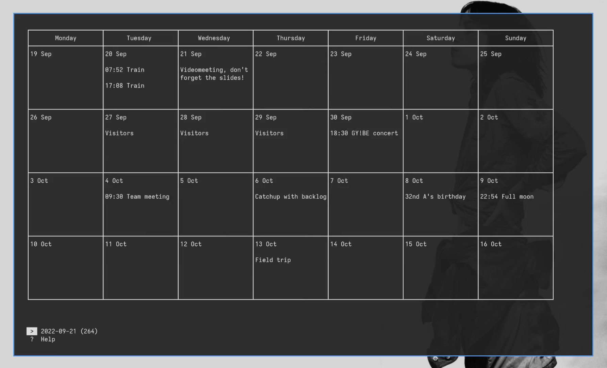
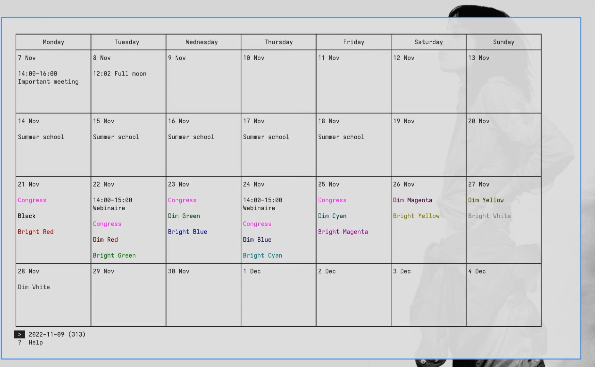
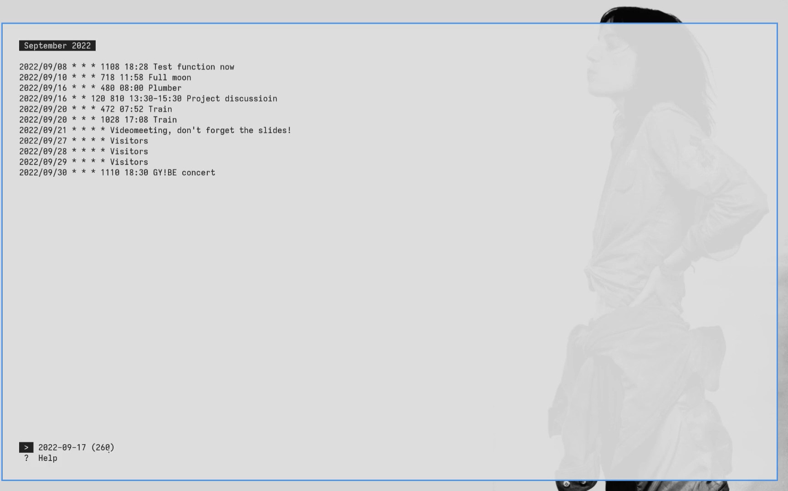
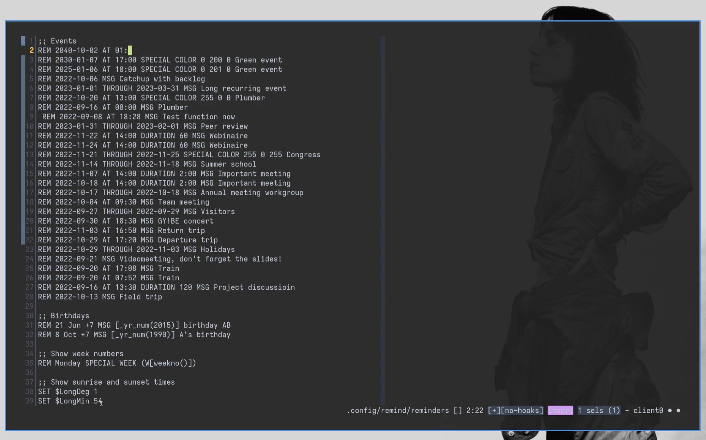
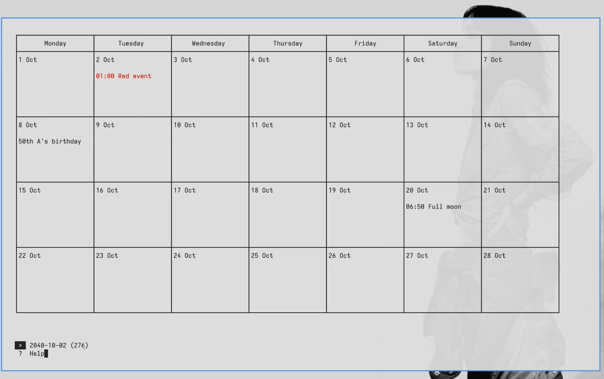
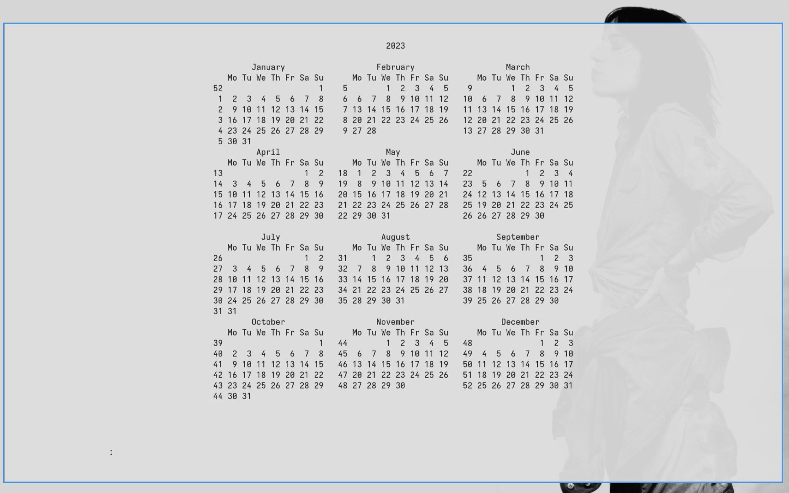

```
                                                 88                ,d
                                                 °°                88     
     8b,dPPYba,   ,adPPYba,  88,dPYba,,adPYba,   88  8b,dPPYba,  MM88MMM
     88P°   °Y8  a8P_____88  88P°   °88°    °8a  88  88P°   '°8a   88
     88          8PP°°°°°°°  88      88      88  88  88       88   88
     88          °8b,   ,aa  88      88      88  88  88       88   88,    
     88           '°Ybbd8°°  88      88      88  88  88       88   °Y888
     
     A simple terminal UI wrapper for D. Skoll's Remind calendar program
```

`remint` is a simple wrapper script to add interactions and navigation to the terminal outputs of D. Skoll's [Remind scripting calendar program](https://salsa.debian.org/dskoll/remind).

## Usage
Make sure Dianne Skoll's `remind` is intalled and that `remint.sh` is executable with `chmod +x /path/to/remint.sh`, then run with `./remint.sh /path/to/a/reminders/file/or/directory` (if the argument is a directory, then `remint` will read from all `*.rem` files in it). `remint` will try default locations if none is supplied as argument. I use it as a script executed in a new terminal window when clicking on the clock of my system bar.

See short demo videos [here](demo/remint.mp4) (showing base functions, initial version) and [here](demo/remint_2.mp4) (showing just a few new functions in a later update).








## Options
`remint` comes with defaults that can be edited at the beginning of the script:
```
DEFAULTFILE="100-remint.rem" # Default file to edit and add new events to if
			     # data path is a directory
COLOR="-@2"         # COLOR="" to disable, COLOR="-@1" for 256 colors only
FORMAT="1"          # FORMAT="1" means 24h format, FORMAT="0" means am/pm
VIEW="calendar"     # VIEW="list" to display the agenda by default
COLORINVERTED="no"  # COLORINVERTED="yes" to toggle light/dark default mode
SHOWDOYWOY="yes"    # SHOWDOYWOY="no" to hide day of year and week number
WEEKSPAN="4"        # Number of weeks to show by default in week view
MONTHSPAN="1"       # Number of months to show by default in month view
PREFIX="+"          # If PREFIX="+", then the default view shows weeks,
                    # else if PREFIX="", then the default view shows months
SPACING=""          # SPACING="" for fixed cell spacing (see `f` toggle),
		    # else SPACING=",n,m" where n and m are numbers
MONDAYFIRST="m"     # MONDAYFIRST="" to start weeks on Sundays
REMPAGER="less -Ri" # Or REMPAGER="$PAGER" to use your usual PAGER. Useful to
		    # search patterns or scroll long outputs. Beware that not
		    # all pagers can handle Remind's color and escape colors
		    # correctly; "less -Ri" can
```

## Help
```
NAVIGATION
  , p  Prev page          t  Today
  . n  Next page          g  Go to
  h/l  -1/+1 day          o  Navigate from year overview
  k/j  -1/+1 week         q  Quit
  M/m  -1/+1 month    other  Quit with prompt
  Y/y  -1/+1 year

VIEW
    v  Toggle calendar/list views
  w s  Toggle week/month span modes
  [/]  Span -1/+1 week or month per page of current mode
  r 0  Reset default page span of current mode
    z  Toggle Monday/Sunday as first day of the week
  : x  Toggle 24h format
    d  Toggle day of the year and week number
    /  Pipe to pager (e.g. to search pattern, press h for help))
    f  Toggle fixed/collapsed cell spacing
    i  Invert terminal background and foreground colors
    c  Toggle Remind colors
    ?  Show this help

DATA
    a  Add event at selection
    e  Edit data file
    b  Back up data

© 2022 Mathieu Laparie, <mlaparie@disr.it>, MIT license
```
